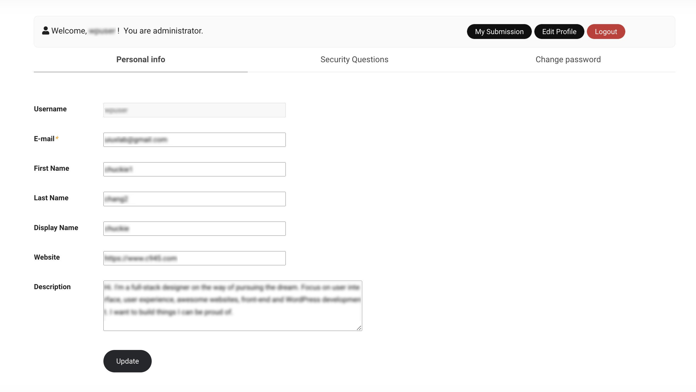
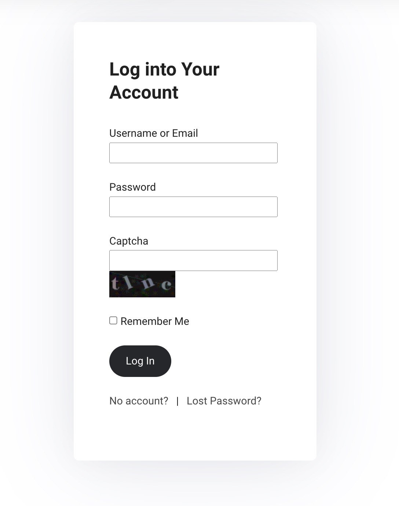
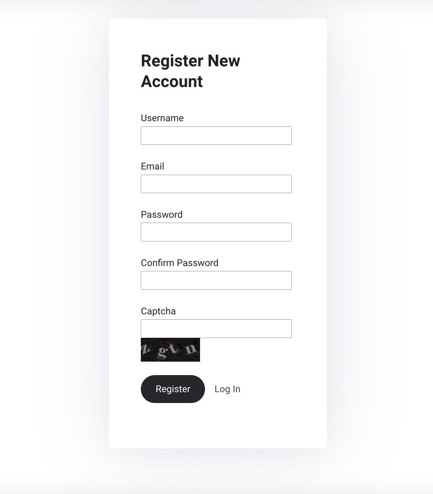
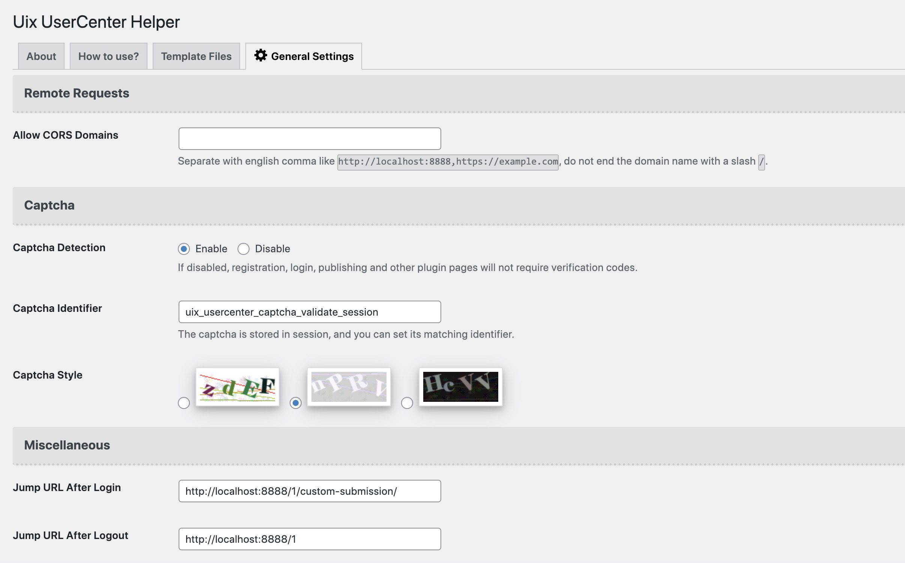
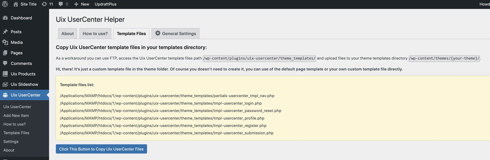

# Uix UserCenter
Sign-in, registration and publishing system with AJAX, support remote API.

Copyright (c) 2022 UIUX Lab [@uiux_lab](https://twitter.com/uiux_lab)

[Plugin for Wordpress at WordPress.org Repository](https://wordpress.org/plugins/uix-usercenter/)

### Licensing

Licensed under the [GPL3.0](http://www.gnu.org/licenses/gpl-3.0.en.html).

### Description

This plugin is a simple way to build, organize and display Sign-in, registration and publishing system with AJAX into any existing WordPress theme. **Using template file to embed your theme.**

### How to use?

1.After activating your theme, you can see a prompt pointed out as absolutely critical. Go to **"Appearance -> Install Plugins"**.
Or, upload the plugin to wordpress, Activate it. (Access the path (/wp-content/plugins/) And upload files there.)

2.You need to create Uix Products template files in your templates directory. You can create the files on the WordPress admin panel. As a workaround you can use FTP, access the Uix Products template files path (`/wp-content/plugins/uix-usercenter/theme_templates/`) and upload files to your theme templates directory (`/wp-content/themes/{your-theme}/`).  

### Screenshot

### Updates

##### = 1.0.1 (November 11, 2022) =

* Tweak: Creation of captcha and nonce only allows post method.

##### = 1.0.0 (October 8, 2022) =

* First release.

### Tested under

- WP 4.2.*
- WP 4.3.*
- WP 4.4.1
- WP 4.4.2
- WP 4.5
- WP 4.5.1
- WP 4.5.2
- WP 4.5.3
- WP 4.6.*
- WP 4.7.*
- WP 4.8.*
- WP 4.9.*
- WP 5.1.*
- WP 5.2.*
- WP 5.3.*
- WP 5.4.*
- WP 5.5.*
- WP 5.6.*
- WP 5.7.*
- WP 5.8.*
- WP 5.9.*
- WP 6.0.*
- WP 6.1.*
